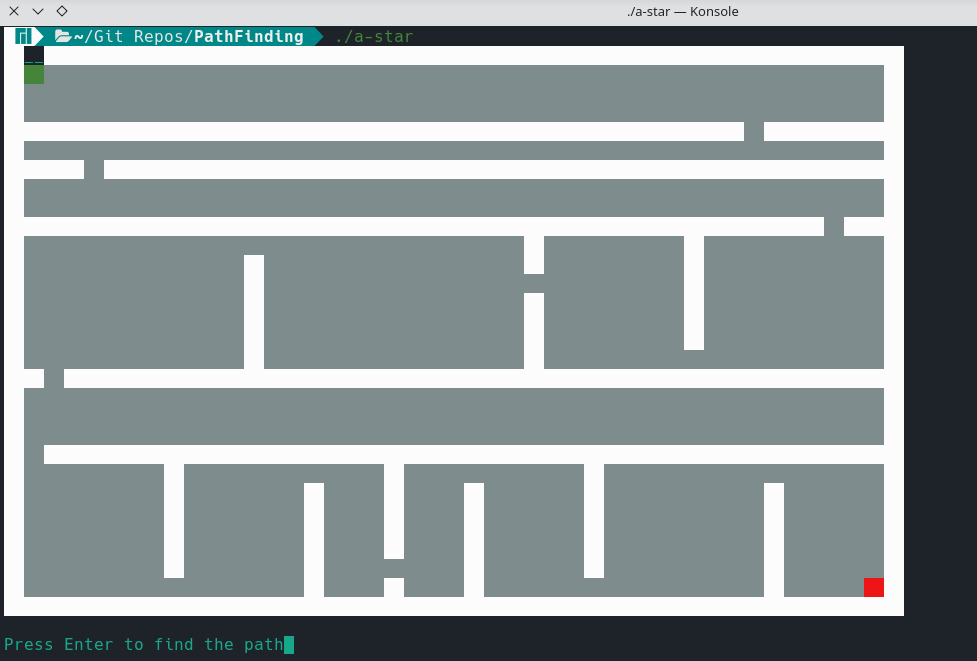
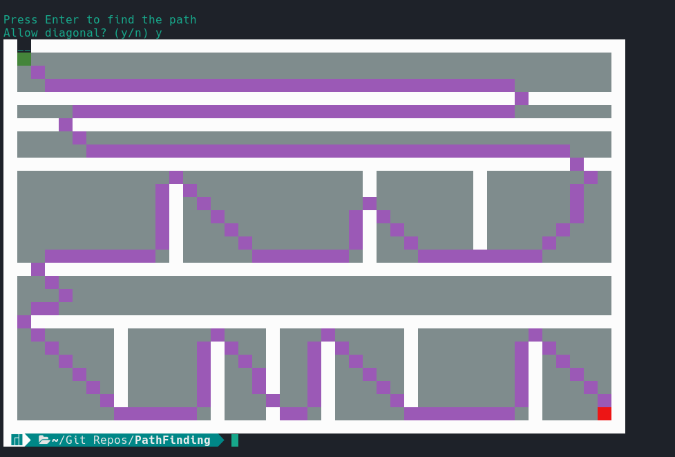

## Console A-Star pathfinding in C++

This is a simple A-Star implementation written in C++ as a console application.  
It has the possibility to enable/disable diagonal movement, and it also has three different types of heuristic-distance:
* Manhattan
* Euclidean
* Diagonal
These can be changed by using the `set_heuristic_distance_type(...)` method of the **Pathfinding** class, by passing either of this constants: *MANHATTAN*, *EUCLIDEAN* or *DIAGONAL*.
 

 
This project is powered by the beautiful TermColor header-only library, found at: https://github.com/ikalnytskyi/termcolor